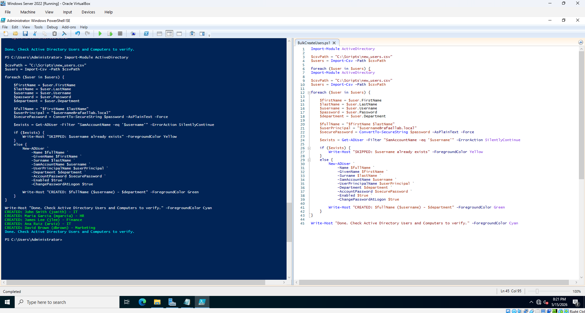
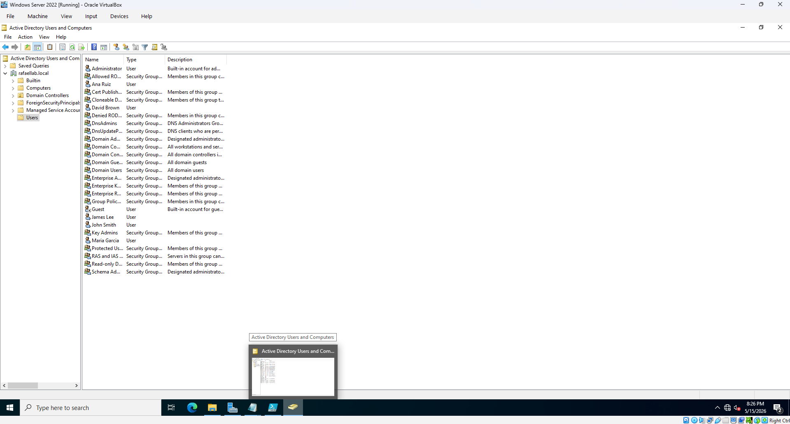

# PowerShell AD Automation Scripts
Scripts for automating Active Directory tasks in a Windows Server 2022 home lab.

## Project 1 — Bulk User Creation from CSV

**What it does:**
Reads a CSV file of new employees and automatically creates their 
Active Directory accounts with the correct name, username, department, 
and a temporary password that forces a reset at first login. 
Skips users that already exist to prevent duplicates.

**Tools used:**
- PowerShell
- Active Directory Domain Services (AD DS)
- Windows Server 2022
- VirtualBox

**How to run:**
1. Edit new_users.csv with your employee data
2. Open PowerShell ISE as Administrator
3. Run BulkCreateUsers.ps1
4. Verify accounts in Active Directory Users and Computers

## Script output

## Active Directory verification

